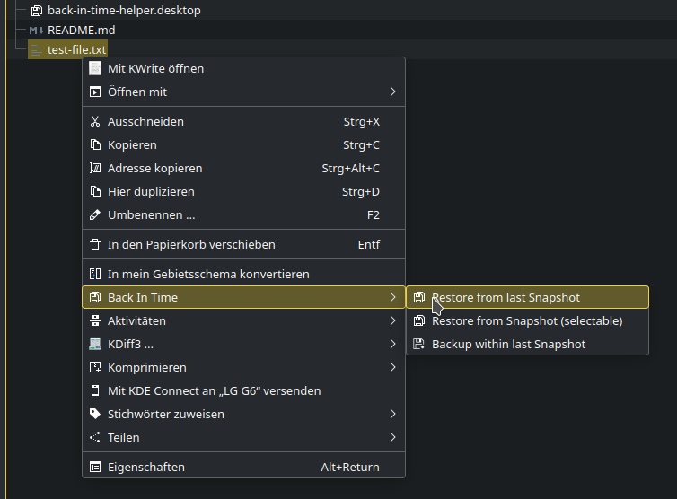

# Back In Time Helper

A KDE 5 dolphin context menu extension (aka Service Menu), that let's you
restore (or backup) any file or folder from within the context menu with
the help of [Back In Time][bitdoc] and rsync(1).

This Action gives the user a very basic but quick approach to the basic
functionality of Back In Time:

* Restore (a target) from last Snapshot
* Restore (a target) from (any user selectable) Snapshot
* Back up (save aka sync) any target within the last Snapshot

A Target is any file or directory (still) existing and the bound of the
context menu.

EXISTING TARGETS WILL NOT BE DELETED BUT RENAMED BEFORE RESTORING.

After Installation this new action should be available in top level of the
context meneu. (if more than one action applies to target, it will be
located under "Actions").

This is a clean room implementation based on [Back In Time][bitdoc], therefore
it lacks any dependencies beside `backintime(1)` and `rsync(1)`.

If backintime is not installed this action will not show up in context menu.

[bitdoc]: https://backintime.readthedocs.io/en/latest/
